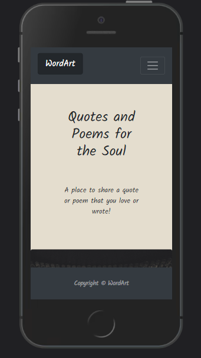
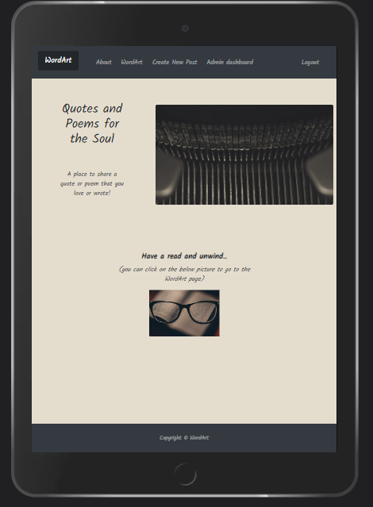

# **WordArt**
As for my **4th** Portfolio Project with [Code Institute](https://codeinstitute.net/) my intention was to build a website that would be an asset for menthal health issues as nowadays i feel like this is quite a common issue. I believe reading in general is healthy and can help and improve a lot on our mindset and emotional state. [WordArt | Quotes and Poems for the Soul](https://wordart.herokuapp.com/) was built for this exact reason.

<!-- TOC -->

- [**WordArt**](#wordart)
- [**Project**](#project)
    - [**Objective**](#objective)
    - [**User Experience UX**](#user-experience-ux)
        - [**User Stories**](#user-stories)
        - [**Wireframes**](#wireframes)
        - [**Site Structure**](#site-structure)
        - [**Design Choices**](#design-choices)
        - [**Typography**](#typography)
        - [**Colour Scheme**](#colour-scheme)
        - [**Project Management**](#project-management)
    - [**Existing Features**](#existing-features)
        - [**Navigation**](#navigation)
        - [**Pages**](#pages)
        - [**Footer**](#footer)
        - [**Account Creation**](#account-creation)
        - [**Admin Dashboard**](#admin-dashboard)
        - [**Automatic Emails**](#automatic-emails)
    - [**Future Features**](#future-features)
    - [**Technologies Used**](#technologies-used)
    - [**Supporting Libraries**](#supporting-libraries)
    - [**Testing**](#testing)
        - [**Manual Testing**](#manual-testing)
        - [**Code Validation**](#code-validation)
        - [**Lighthouse Testing**](#lighthouse-testing)
    - [**Bugs**](#bugs)
    - [**Deployment**](#deployment)
    - [**Credits**](#credits)
        - [**Content**](#content)
        - [**Media**](#media)
    - [**Recognition**](#recognition)

<!-- /TOC -->

# **Project**
## **Objective**
I love reading all kinds of things like books, short stories, poems, quotes. Reading can be a great way to relax and unwind. It can help reduce stress, anxiety, and depression by providing a mental escape from daily pressures.
 
The objective of this app would be to provide a user-friendly platform for users to find, share, and discuss their favorite quotes and poems, while also allowing them to connect with other like-minded individuals.
## **User Experience UX**
### **User Stories**
### **Wireframes**
### **Site Structure**
### **Design Choices**
### **Typography**
### **Colour Scheme**
### **Project Management**
## **Existing Features**
### **Navigation**
### **Pages**
### **Footer**
### **Account Creation**
### **Admin Dashboard**
### **Automatic Emails**
## **Future Features**
## **Technologies Used**
## **Supporting Libraries**
## **Testing**
### **Manual Testing**
### **Code Validation**
### **Lighthouse Testing**
## **Bugs**
## **Deployment**
## **Credits**
### **Content**
### **Media**
## **Recognition**
