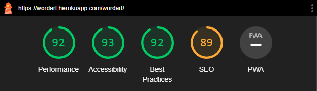

# **WordArt**
As for my **4th** Portfolio Project with [Code Institute](https://codeinstitute.net/) my intention was to build a website that would be an asset for menthal health issues as nowadays i feel like this is quite a common issue. I believe reading in general is healthy and can help and improve a lot on our mindset and emotional state. [WordArt | Quotes and Poems for the Soul](https://wordart.herokuapp.com/) was built for this exact reason.

## Table of contents

<!-- TOC -->

- [**WordArt**](#wordart)
    - [Table of contents](#table-of-contents)
- [**Project**](#project)
    - [**Objective**](#objective)
    - [**User Experience UX**](#user-experience-ux)
        - [**User Stories**](#user-stories)
            - [**User**](#user)
            - [**Admin**](#admin)
        - [**Wireframes**](#wireframes)
        - [**Site Structure**](#site-structure)
        - [**Design Choices**](#design-choices)
        - [**Project Management**](#project-management)
    - [**Existing Features**](#existing-features)
        - [**Navigation**](#navigation)
        - [**Pages**](#pages)
        - [**Footer**](#footer)
        - [**Account Creation**](#account-creation)
        - [**Admin Dashboard**](#admin-dashboard)
        - [**User Dashboard**](#user-dashboard)
        - [**Automatic Emails**](#automatic-emails)
    - [**Future Features**](#future-features)
    - [**Technologies Used**](#technologies-used)
        - [**Languages**](#languages)
        - [**Frameworks & Software**](#frameworks--software)
    - [**Supporting Libraries**](#supporting-libraries)
    - [**Testing**](#testing)
        - [**Manual Testing**](#manual-testing)
        - [**Code Validation**](#code-validation)
        - [**Lighthouse Testing**](#lighthouse-testing)
    - [**Bugs**](#bugs)
    - [**Deployment**](#deployment)
    - [**Credits**](#credits)
        - [**Content**](#content)
        - [**Media**](#media)
    - [**Recognition**](#recognition)

<!-- /TOC -->

# **Project**
## **Objective**

I love reading all kinds of things like books, short stories, poems, quotes. Reading can be a great way to relax and unwind. It can help reduce stress, anxiety, and depression by providing a mental escape from daily pressures.
 
The objective of this app would be to provide a user-friendly platform for users to find, share, and discuss their favorite quotes and poems, while also allowing them to connect with other like-minded individuals.

[JUMP to TOP](<#table-of-contents>)

## **User Experience UX**
### **User Stories**

#### **User**
| | | |
|:-------:|:--------|:--------|
| As a User | i can view posts so that i can read a quote or a poem | &check; |
| As a User | i can view the likes on each post so that i can see which ones are most appreciated | &check; |
| As a User | i can select a post so that i can view related comments | &check; |
| As a User | i can read the comment section for each post so that i can see other users' opinion | &check; |
| As a User | i can sign up for an account so that i can be part of the community | &check; |
| As a User | i can login into my account so that i can like, comment and post | &check; |
| As a User | i can post a quote or poem so that i can contribute to the website | &check; |
| As a User | i can like or unlike a post so that i can show appreciation | &check; |
| As a User | i can leave comments on a post so that i can interact with the content and other users | &check; |
| As a User | i can create, read, update and delete my posts so that i can amend my content | &check; |
| As a User | i can edit my comments so that i can rectify any mistakes or amend if changed my mind | &check; |
| As a User | i can edit a post so that i can control my content | &check; |
| As a User | i can delete my posts so that i can control my content | &check; |
| As a User | i can edit my comment so that i can correct any mistakes | &check; |
| As a User | i can delete my comment so that i can remove them | &check; |
| As a User | i receive email confirmation of my registration so that i know it was successful | &check; |
| As a User | i can select a category so that i can choose what i want to read | X |

#### **Admin**

| | | |
|:-------:|:--------|:--------|
| As an Admin | i have a dashboard so that i can control the site's content | &check; |
| As an Admin | i can create, read, update and delete posts so that i can manage the site's content | &check; |
| As an Admin | i can create, read, update and delete comments so that i can manage the comment section | &check; |
| As an Admin | i can approve or disapprove posts so that i can filter out the content | &check; |
| As an Admin | i receive email notifications so that i can keep track of what is happening on the website | &check; |

[JUMP to TOP](<#table-of-contents>)

### **Wireframes**

The WIREFRAMES for WordArt were created with [Wireframe.cc](https://wireframe.cc/) to help visualize the project. They slightly differ from the website's final look due to developements and new ideas during creation.

* Desktop  

* Tablet  

* Mobile  

[JUMP to TOP](<#table-of-contents>)

### **Site Structure**

The WordArt website has 2 main pages when accessed by a user who is not logged in and 4 pages when the user is logged in.

* User interface:
    - About page - this is the page that welcomes the user when accessing the website
    - WordArt page - here users can find all Quotes and Poems posted on the website

* Admin dashboard:
    - The admin dashboard is only accessible by the superuser. The purpose is to manage and maintain the website content.

[JUMP to TOP](<#table-of-contents>)

### **Design Choices**
* **Typography**

Kalam's letterforms feature a very steep slant from the top right to the bottom left. They are similar to letters used in everyday handwriting, and look like they might have been written with either a thin felt-tip pen, or a ball-point pen. In the Devanagari letterforms, the knotted-terminals are open, but some other counter forms are closed.

Like many informal handwriting-style fonts, it appears rather fresh and new when seen on screen or printed on the page.

I have chosen the Kalam font for the website (falls back on cursive). Choice was made due to the fonts hadnwriting effect which is complementing the website's aesthetics..

* **Colour Scheme**

The colour scheme choice was somewhat based on the main page's hero image keeping a common attribute throughout the whole website.

The color scheme visualisation was made using [Coolors](https://coolors.co/).

[JUMP to TOP](<#table-of-contents>)

### **Project Management**

Throughout the building of this project i have used GitHub project board to manage the workflow. This tool helped me organize and prioritize my work. With GitHub project board, I was able to create a visual representation of the project's tasks, workflows, and progress.

GitHub project board was divided into three columns: "To Do", "In Progress", and "Done". I have created issues within github for each user story and added labels to each to indicate the priority and status of the task.

GitHub project board helped me to:
* keep track of my progress and stay on track with the deadlines.
* prioritize tasks based on their importance and urgency.
* easily move tasks between columns as they were completed

Overall, using GitHub project board helped me to stay organized and focused throughout the project.

[JUMP to TOP](<#table-of-contents>)

## **Existing Features**
### **Navigation**

* **Title**
Placed at the top left corner of the page it displays the name of the website: **WordArt** which also links to the About (home) page.

* **Navigation bar**

The navigation bar is displayed differeently depending on the user being logged in as well as if the user is a superuser or not.

|    |About|WordArt|Sign up|Login|Logout|User dashboard|Admin dashboard|
|:----|:----|:----|:----|:----|:----|:----|:----|
|**Not logged in**|&check;|&check;|&check;|&check;|X|X|X|
|**User logged in**|&check;|&check;|X|X|&check;|&check;|X|
|**Superuser logged in**|&check;|&check;|X|X|&check;|X|&check;|

* Not logged in

* User logged in

* Superuser logged in

The navigation bar is also responsive based on the device screen size. After breakpoint it collapses into dropdown menu.

[JUMP to TOP](<#table-of-contents>)

### **Pages**

* About

This is the page that welcomes the user upon accessing the website. There is a brief overview of what the site is about and how to join the community.

* WordArt

This page contains all quotes and poems posted on the website. These can be viewed without the user being logged in. 

* Sign up

For creating an account, the user can sign up here.

* Login

Once account has been created the user can login on this page.

* Logout

If the user wishes to logout, this can be done here by confirming this action.

Actions like Sign up, Login, Sign out, Post are all confirmed to the user with a success message that disappears automatically after a short time.

* Login

* Logout

* Create Post

* **User dashboard**

Once user account has been created and the user is logged in they gain access to their own user dashborad where they can view and manage all posts made by them.

* **Admin dashboard**

If the user logged in is a superuser, this is the place where they can manage the site from. They are able to approve/disapprove posts, comments and/or users. This dashboard is for managing and maintaining the website.

This page will redirect to the default Django Administration website provided by Django.

[JUMP to TOP](<#table-of-contents>)

### **Footer**

The footer section contains contact and a cpoyright information.

[JUMP to TOP](<#table-of-contents>)

### **Account Creation**

To enable users to be able to create an account on the website, I used a package called Django AllAuth and then customised the html pages to fit the theme of the website.

<b>Signup image</b>

 

<b>Login image</b>

 

[JUMP to TOP](<#table-of-contents>)

### **Admin Dashboard**
### **User Dashboard**

### **Automatic Emails**

For this project i found it useful to implement automated emails for a further form of confirmation or reminder for the user and for the superuser as well.

* Superuser post approval

* User confirm registration

[JUMP to TOP](<#table-of-contents>)

## **Future Features**

For the future i am planning to split the **quotes** and **poems** into two different pages and implement a **search by keywords feature**. I would also like to further **customize the superuser dashboard** and create a simple **admin dashboard** for staff.

[JUMP to TOP](<#table-of-contents>)

## **Technologies Used**

### **Languages**

[CSS3](https://en.wikipedia.org/wiki/CSS) - Provides the styling for the website.

[HTML5](https://developer.mozilla.org/en-US/docs/Glossary/HTML5) - Provides the content and structure for the website.
[JavaScript](https://www.javascript.com/) - Provides interactive elements of the website.

[Python](https://www.python.org/) - Provides the functionality for the site.

[JUMP to TOP](<#table-of-contents>)

### **Frameworks & Software**

[Bootstrap](https://getbootstrap.com/) - CSS framework directed at responsive, mobile-first front-end web development.

[Cloudinary](https://cloudinary.com/) - Used to host all static files.

[Colorpicker](https://imagecolorpicker.com/en) - Used to create the colorscheme of the project.

[CSS Validation](https://jigsaw.w3.org/css-validator/) - Used to validate CSS code.

[Django](https://www.djangoproject.com/) - A model-view-template framework used to create WordArt.

[GitBash](https://www.atlassian.com/git/tutorials/git-bash) - Terminal used to push changes to the GitHub repository.

[GitHub](https://github.com/) - Used to host and deploy the website.

[Google Chrome DevTools](https://developer.chrome.com/docs/devtools/) - Used to test responsiveness and debug.

[Heroku](https://dashboard.heroku.com/apps) - Used to deploy the website.

[HTML Validation](https://validator.w3.org/) - Used to validate HTML code.

[JSHint Validation](https://jshint.com/) - Used to validate JavaScript code.

[Lighthouse](https://chrome.google.com/webstore/detail/lighthouse/blipmdconlkpinefehnmjammfjpmpbjk) - Used to test performance of site.

[Microsoft Excel](https://www.microsoft.com/en-gb/microsoft-365/excel) - Used to create model mockups.

[Python syntax Checker PEP8](https://www.pythonchecker.com/) - Used to validate Python code.

[VSCode](https://code.visualstudio.com/) - Used to create and edit the website.

[Wireframes.cc](https://wireframe.cc/) - Used to create the wireframes.

[JUMP to TOP](<#table-of-contents>)

## **Supporting Libraries**

***asgiref***: ASGI framework used for building Python web applications and servers.

***cloudinary***: Image and video management cloud platform for developers.

***dj-database-url***: Utility library for parsing database connection URLs in Django projects.

***dj3-cloudinary-storage***: Cloudinary file storage engine for Django 3.0 and higher.

***Django***: High-level Python web framework for rapid development of secure and maintainable websites.

***django-allauth***: Authentication app for Django

***django-crispy-forms***: DRY Django forms library to build beautiful bootstrap forms easily and without re-inventing the wheel.

***django-sequences***: Implementation of unique sequences for Django models.

***django-summernote***: WYSIWYG editor for Django, using the Summernote JavaScript library.

***gunicorn***: Python WSGI HTTP Server for UNIX.

***oauthlib***: OAuth 1.0 and 2.0 support for Python.

***psycopg2***: PostgreSQL database adapter for Python.

***PyJWT***: JSON Web Token implementation in Python.

***python-slugify***: A Python library that simplifies the generation of URL slugs for Unicode strings.

***python3-openid***: OpenID support for modern servers and consumers.

***pytz***: World timezone definitions, modern and historical.

***requests-oauthlib***: OAuth library for Python requests.

***sqlparse***: Non-validating SQL parser for Python.

***text-unidecode***: ASCII transliterations of Unicode text.

[JUMP to TOP](<#table-of-contents>)

## **Testing**
### **Manual Testing**

* **Testing user stories**

    * **As a User**	i can view posts so that i can read a quote or a poem
        * can be accessed on the WordArt page of the website ✓
    * **As a User**	i can view the likes on each post so that i can see which ones are most appreciated	
        * can be seen on the WordArt page under each post. ✓
    * **As a User**	i can select a post so that i can view related comments	
        * every posts title is a link to a post detail page where comments are displayed ✓
    * **As a User**	i can read the comment section for each post so that i can see other users' opinion	
        * on the post detail view the comments are displayed chronologically under each post ✓
    * **As a User**	i can sign up for an account so that i can be part of the community	
        * on the right side of the navigation bar there's a link to the signup page ✓
    * **As a User**	i can login into my account so that i can like, comment and post 
        * on the right side of the navigation bar there's a link to the login page ✓
    * **As a User**	i can post a quote or poem so that i can contribute to the website
        * for logged in users there is the 'create new post' page  ✓
    * **As a User**	i can like or unlike a post so that i can show appreciation	
        * posts can be liked from the post detail view using the heart ✓
    * **As a User**	i can leave comments on a post so that i can interact with the content and other users
        * comments section can be found on post detail view under the post ✓
    * **As a User**	i can create, read, update and delete my posts so that i can amend my content
        * the user can do this either from the user dashboard or from wordart page by opening post detail view ✓
    * **As a User**	i can edit my comments so that i can rectify any mistakes or amend if changed my mind
        * this can be done in the comments section ✓
    * **As a User**	i can delete my comment so that i can remove them
        * this can be done in the comments section of the post ✓
    * **As a User**	i receive email confirmation of my registration so that i know it was successful
        * after registration the user receievs an email with confirmation of registration and a verification link ✓
    * **As a User**	i can select a category so that i can choose what i want to read
        * this feature can be implemented in the future as mentioned in the [Future features section](#future-features) X
     
     
    *   **As an Admin**	i have a dashboard so that i can control the site's content	
        * django administration site ✓
    * **As an Admin** i can create, read, update and delete posts so that i can manage the site's content	
        * can be done from the django administration site ✓
    * **As an Admin** i can create, read, update and delete comments so that i can manage the comment section
        * can be done from the django administration site ✓
    * **As an Admin** i can approve or disapprove posts so that i can filter out the content
        * can be done from the django administration site ✓
    * **As an Admin** i receive email notifications so that i can keep track of what is happening on the website
        * with every new post the superuser receives an email to inform them that there is a post waiting for approval ✓

[JUMP to TOP](<#table-of-contents>)

### **Code Validation**

The WordArt code has been validated with  [W3C HTML Validator](https://validator.w3.org/), [W3C CSS Validator](https://jigsaw.w3.org/css-validator/), [JSHint JavaScript Validator](https://jshint.com/) and [Python syntax Checker PEP8](https://www.pythonchecker.com/):

<b>HTML validation - About page</b>

 

<b>HTML validation - Wordart page - error</b>

 

<b>HTML validation - Wordart page - fix</b>

 

<b>HTML validation - Signup page</b>

 

<b>HTML validation - Login page</b>

 

<b>HTML validation - Logout page</b>

 

<b>HTML validation - User dashboard page</b>

 

<b>HTML validation - Create new post page</b>

 

<b>CSS validation</b>

 

<b>JS validation</b>

 

<b>Python syntax Checker PEP8 (write/admin.py)</b>

 

<b>Python syntax Checker PEP8 (write/apps.py)</b>

 

<b>Python syntax Checker PEP8 (write/forms.py)</b>

 

<b>Python syntax Checker PEP8 (write/models.py)</b>

 

<b>Python syntax Checker PEP8 (write/urls.py)</b>

 

<b>Python syntax Checker PEP8 (write/views.py)</b>

 

[JUMP to TOP](<#table-of-contents>)

### **Lighthouse Testing**
 

<b>About Page</b>

 

<b>Create New Post Page</b>

 

<b>Signup Page</b>

 

<b>Login Page</b>

 

<b>Logout Page</b>

 

<b>User dashboard Page</b>

 

<b>WordArt Page</b>

 

[JUMP to TOP](<#table-of-contents>)

## **Bugs**
## **Deployment**
## **Credits**
### **Content**
### **Media**
## **Recognition**
